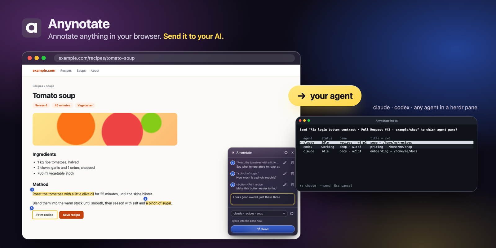
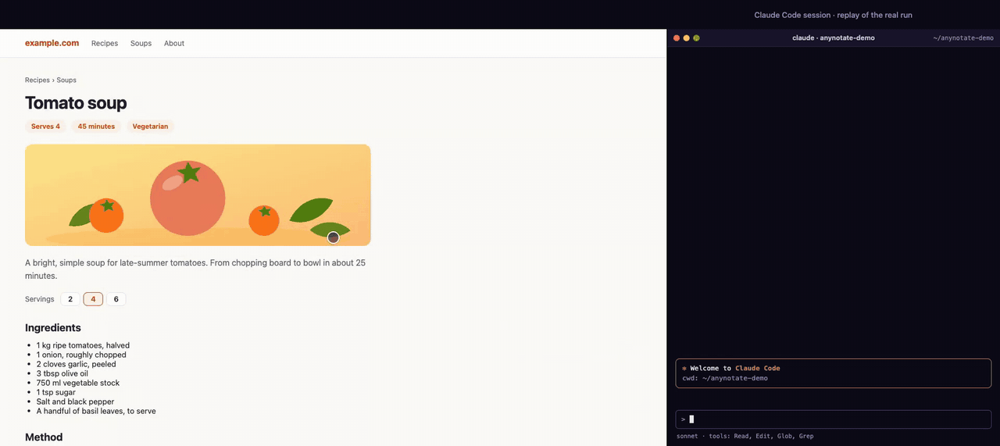
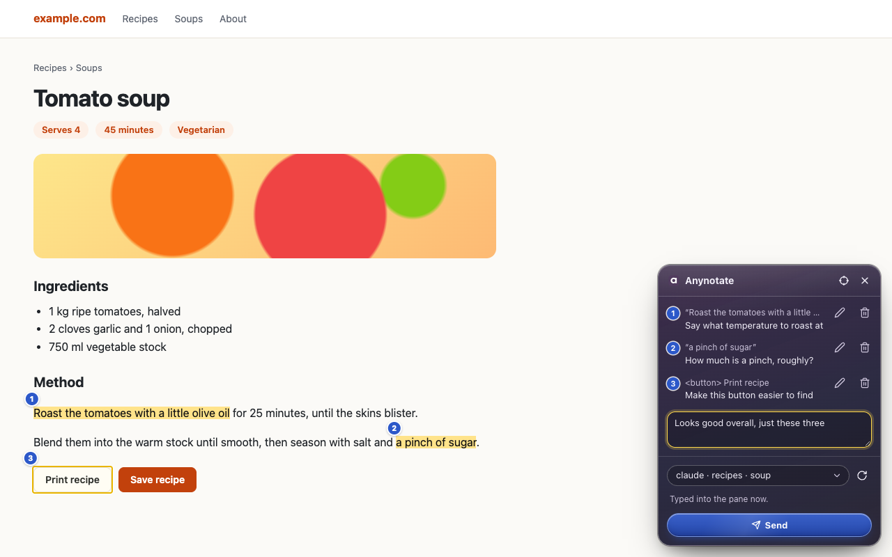
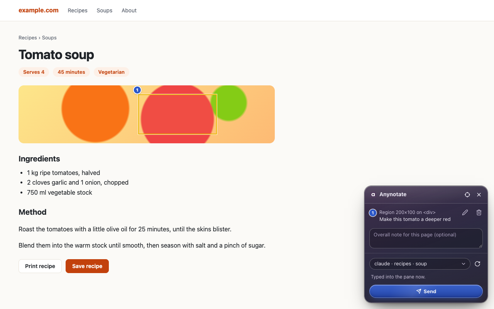
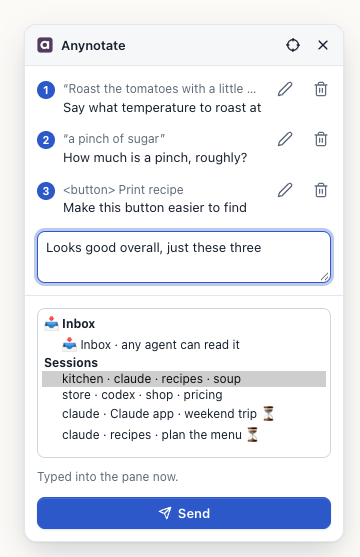
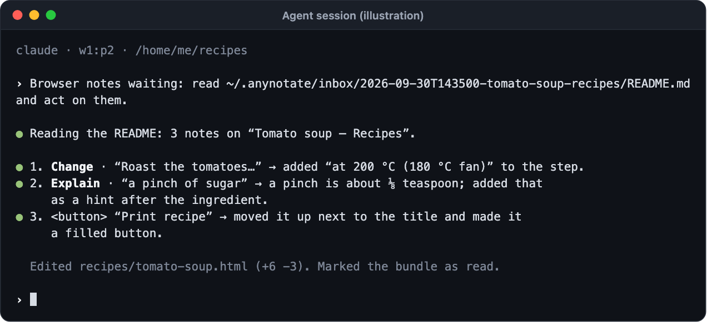

<p align="center">
  
</p>

<h1 align="center">Anynotate</h1>

<p align="center"><strong>Annotate anything in your browser. Send it to your AI.</strong></p>

<p align="center">
  <a href="https://github.com/genexk/anynotate/releases/latest"></a>
  <a href="https://github.com/genexk/anynotate/actions/workflows/ci.yml"></a>
  <a href="./LICENSE"></a>
  <a href="https://chromewebstore.google.com/detail/lefcmfmbmjmgfkgbbcodolcecbnfjgpp"></a>
  
</p>

<p align="center">
  <a href="https://genexk.github.io/anynotate/">Website</a> ·
  <a href="https://genexk.github.io/anynotate/guide/">Guide</a> ·
  <a href="https://genexk.github.io/anynotate/support/">Support</a> ·
  <a href="https://github.com/genexk/anynotate/issues/new?template=bug_report.yml">Report a bug</a> ·
  <a href="https://buymeacoffee.com/genexk">Buy me a coffee</a>
</p>

<p align="center">
  
</p>

## ✨ What it does

- 🖍️ **Note anything on a page** — select text, pick an element or drag a region, and tag each note *explain*, *change* or *approve*.
- 🎯 **Send it to a live session** — Claude Code, Codex, or any agent in a [herdr](https://herdr.dev) pane, picked from one Sessions list.
- 📥 **One inbox for every other agent** — read with `/annotations`, over MCP, or from a file.
- 🖥️ **Desktop apps too** — Claude Desktop, Cursor and the Codex app read notes through a local MCP server, set up on install.
- 🔄 **Built for live pages** — notes stay put through ticking counters, re-rendered lists, hash routes and frames.
- 🔒 **Private by default** — passwords, card numbers and one-time codes are covered in screenshots, and the bridge listens only on `127.0.0.1`.
- 🧹 **Cleans up after itself** — bundles are deleted 30 days after delivery, or whenever you choose.
- 🌍 **Chrome, Edge, Brave and Chromium** on macOS, with Windows and Linux in beta.

## 🚀 Quick start

**1. Install the bridge**

```bash
# macOS, or Linux (beta)
curl -fsSL https://github.com/genexk/anynotate/releases/latest/download/install.sh | sh
```

```powershell
# Windows (beta; PowerShell 5.1 or later)
irm https://github.com/genexk/anynotate/releases/latest/download/install.ps1 | iex
```

**2. Add the extension** from the [Chrome Web Store](https://chromewebstore.google.com/detail/lefcmfmbmjmgfkgbbcodolcecbnfjgpp). It finds the bridge by itself; no pairing or copy-paste.

**3. Press <kbd>Alt</kbd>+<kbd>Shift</kbd>+<kbd>A</kbd>** (<kbd>⌥</kbd><kbd>⇧</kbd><kbd>A</kbd> on a Mac) on any page, leave a note, pick a session and hit **Send**.

> [!TIP]
> Using Claude Desktop, Cursor or Codex? The installer connects them automatically; restart the app. To add one later: `anynotate mcp install --claude-desktop` (or `--cursor`, `--codex`, `--claude-code`).

## 🎬 See it in action

<p align="center">
  
</p>

The same clip as a video: [genexk.github.io/anynotate/#demo](https://genexk.github.io/anynotate/#demo).

## 📸 See it

| | |
|:---:|:---:|
|  |  |
| **Notes on a page** — highlights stay readable | **Regions** — box anything, even a canvas |
|  |  |
| **Pick a target** — panes, sessions or the 📥 Inbox | **Your agent receives** — one line, then it gets to work |

More in the [guide](https://genexk.github.io/anynotate/guide/).

## 🤝 Works with

| Agent | How notes arrive |
|---|---|
| **Claude Code** | prompt hook (⏳ with your next message), or typed in when it runs in a herdr pane |
| **Codex** CLI | prompt hook (⏳ with your next message), or typed in when it runs in a herdr pane |
| **Any agent in a [herdr](https://herdr.dev) pane** | typed into the pane now, as the bundle's README path |
| **Claude Desktop · Cursor · Codex app** | MCP (`anynotate mcp`), auto-configured on install |
| **Anything that reads a file** | the 📥 Inbox at `~/.anynotate/inbox/latest/README.md` |

> [!NOTE]
> Windows and Linux are in beta. Reports from them are especially welcome: [report a bug](https://github.com/genexk/anynotate/issues/new?template=bug_report.yml).

## 📚 Reference

<details>
<summary>🔍 <b>Features in detail</b></summary>

- **Notes:** turn on with <kbd>Alt</kbd>+<kbd>Shift</kbd>+<kbd>A</kbd>, then select text (mouse, or <kbd>Shift</kbd> and the arrow keys), pick an element (crosshair, <kbd>Alt</kbd>+<kbd>Shift</kbd>+<kbd>E</kbd>, or <kbd>Alt</kbd>-click, open shadow roots included), or drag a region with the picker. Tag a note explain, change or approve; edit or delete it from the page or the panel. A crop is taken when the note is made.
- **Live pages:** notes stay attached through ticking values (ages like `36s`, counters), re-rendered lists and hash routes. An off-screen note gets **Scroll to**; one that can't be found can be kept or marked orphaned. Off-screen and orphaned notes are sent with their crop, marked "Not on the page when sent". When a page's URL changes, the panel offers "N notes from /path match this page" with **Show here**.
- **Frames:** same-site frames work like the page. Frames from other sites are picked whole until you press **Allow** for that site (one Allow covers every claude.ai artifact); allowed sites are removable in the extension's Options under "Frames from other sites". Payment frames are never entered.
- **Targets:** one Sessions list of herdr panes (typed in now) and Claude Code or Codex sessions outside herdr (⏳, arrives with your next message), labelled `workspace · agent · folder · title` with the session's real title (`Claude app` as the folder for a Claude Code session in the Claude desktop app), plus one 📥 Inbox any agent reads. A hint line under the picker says how the chosen target gets the notes.
- **Privacy:** password, payment-card and one-time-code fields are covered in screenshots and blanked in captured text, including inside allowed frames. The panel sits in a closed shadow root the page can't read. Pages the extension can't run on (browser pages, the Chrome Web Store, PDFs) say why.
- **Browsers and platforms:** Chrome, Edge, Brave and Chromium; bridge, installers, `update`, `uninstall`, `doctor` and `status` on macOS, plus Linux and Windows in beta.

</details>

<details>
<summary>📦 <b>What the installer does</b></summary>

The installer downloads the release binary for your machine (`darwin-arm64`, `darwin-x64`, `linux-x64`, `linux-arm64` or `windows-x64`), checks it against the release's `SHA256SUMS`, puts it in place and runs `anynotate install`. It needs no root or administrator rights. Set `ANYNOTATE_VERSION=0.4.0` to pin a release, or `ANYNOTATE_BIN_DIR` to install elsewhere.

`anynotate install` (re-run it any time; it also restarts the bridge) writes:

| | macOS | Linux (beta) | Windows (beta) |
|---|---|---|---|
| Binary | `~/.local/bin/anynotate` | `~/.local/bin/anynotate` | `%LOCALAPPDATA%\anynotate\bin\anynotate.exe`, added to the user `PATH` |
| Bridge service | launchd agent `~/Library/LaunchAgents/dev.anynotate.bridge.plist` | systemd user unit `~/.config/systemd/user/anynotate-bridge.service`; without user systemd, `~/.config/autostart/anynotate-bridge.desktop` running `anynotate bridge --detach` | `HKCU\…\CurrentVersion\Run` value `Anynotate Bridge` starting `~\.anynotate\bridge.vbs`, which runs `anynotate bridge --detach` |
| Chrome helper | `dev.anynotate.host.json` in each browser's `NativeMessagingHosts` dir | same, under `~/.config` | `~\.anynotate\dev.anynotate.host.json`, registered under `HKCU\Software\<browser>\NativeMessagingHosts` |
| Data | `~/.anynotate` (token, origins, inbox, `install.json`) | same | `%USERPROFILE%\.anynotate` |

The Chrome helper is registered for Chrome, plus Edge, Brave and Chromium (on macOS and Linux, those that are installed). For Claude Code and Codex, when found, it also adds a prompt hook to `~/.claude/settings.json` / `~/.codex/hooks.json` and an `annotations` skill; hooks and services name the binary by absolute path. `anynotate install --dry-run` lists every step without writing anything.

`install` adds the prompt hook and `annotations` skill only for CLIs it finds (`claude` / `codex` on `PATH`, or `~/.claude` / `~/.codex`) and logs `skip <cli> (not installed)` for the rest. `install` also removes Gemini CLI hooks left by older Anynotate versions (backup `.bak-anynotate`), and `~/.gemini/commands/annotations.toml` if it is unchanged.

If `~/.local/bin` is not on your `PATH`, the installer says so; add it in your shell profile (`export PATH="$HOME/.local/bin:$PATH"`). On Windows, open a new terminal after installing to pick up the `PATH` change.

</details>

<details>
<summary>🩺 <b>Check, update, remove</b></summary>

```bash
anynotate doctor               # install, PATH, service, bridge /health, token, extension, Chrome helper, hooks, retention
anynotate update --dry-run     # show what an update would do
anynotate update               # install the latest release and restart the bridge
anynotate uninstall --dry-run
anynotate uninstall            # add --purge to delete ~/.anynotate (your notes) as well
```

`doctor` exits non-zero only when a required check fails. `update` downloads the newest release for your platform from GitHub, verifies it against `SHA256SUMS`, replaces the binary and re-runs `install`; on Windows the running binary is moved aside to `anynotate.exe.old`. `uninstall` stops the bridge and removes the service, the Chrome helper registrations, the hooks and skills (a `SKILL.md` you edited is kept), and the binary (on Windows it also takes the bin directory off the user `PATH`). It keeps `~/.anynotate` unless you pass `--purge`.

Out of step? Sending still works: the extension says when the bridge is older than it expects and offers `anynotate update` to copy; a bundle from an older extension says so under its README title and in `read_notes`, and `doctor` lists each extension it has seen in the last 14 days (Chrome profiles and builds show up as separate entries) while `status` sums them up.

</details>

<details>
<summary>⌨️ <b>CLI and keyboard shortcuts</b></summary>

Anynotate has two halves: a bridge on `127.0.0.1` that accepts annotation bundles, and a prompt hook that hands queued bundles to the CLI session they were aimed at.

```bash
anynotate bridge              # run the bridge in the foreground instead (default port 47291)
anynotate token               # print the bridge token (created on first use, mode 600)
anynotate annotations         # list the 10 newest bundles
anynotate annotations latest  # print one bundle's README (or pass an id); a queued bundle becomes delivered
anynotate inbox               # browse bundles: read, send to a herdr pane, delete (--plain prints a list)
anynotate deliver latest --pane <pane_id>   # type a bundle (or pass an id) into a herdr agent pane; --dry-run to preview
anynotate status              # one-line health summary; --notify shows it as a herdr notification
```

**Keyboard shortcuts.** Defaults: `Alt+Shift+A` toggles annotate mode, `Alt+Shift+E` picks an element, `Alt+Shift+S` sends (`⌥⇧A`, `⌥⇧E`, `⌥⇧S` on a Mac). Chrome leaves a shortcut unset when another extension or program already uses it; set or change them at `chrome://extensions/shortcuts` (`edge://extensions/shortcuts` in Edge). Clicking the toolbar icon always works. More in [Support](https://genexk.github.io/anynotate/support/#shortcuts).

</details>

<details>
<summary>🤖 <b>Any agent: herdr panes, the Inbox and prompt hooks</b></summary>

An agent needs no Anynotate-specific setup to receive notes:

- In a herdr pane, any agent herdr detects is listed in the dock's Sessions list as `workspace · agent · folder · title`, and a bundle sent to it is typed into the pane as the bundle's README path.
- Anywhere else, send to the 📥 Inbox in the dock, one target for every agent. Any agent reads it when asked: with `/annotations`, over MCP (`anynotate mcp`), from `~/.anynotate/inbox/latest/README.md` or with `anynotate annotations latest`. `inbox/latest` is a symlink to the bundle written last (a junction on Windows); `inbox/latest-id` holds that bundle's id, for when the link can't be created or followed.

The prompt hooks for Claude Code and Codex are an optional extra: they inject bundles queued for a session on its next prompt. Those sessions share the Sessions list with herdr panes, marked ⏳; one in the Claude desktop app shows `Claude app` as its folder.

</details>

<details>
<summary>🖥️ <b>Desktop apps (MCP)</b></summary>

Apps without hooks or a terminal, such as Claude Desktop (chat and Cowork), the Codex app and Cursor, read notes through `anynotate mcp`, a local MCP server that runs over stdio and never touches the network. `install` (and so `update`) adds it to every app it finds: Claude Desktop, Cursor, Codex, and Claude Code when `claude` is on `PATH`. It ends with one `MCP:` line naming them. `ANYNOTATE_NO_MCP=1` skips this. `--no-mcp`, or `anynotate mcp uninstall --<app>` for one app, also keeps it skipped on later installs and updates (recorded in `~/.anynotate/mcp.json`) until you `mcp install` it again. An `anynotate` entry you pointed at your own command is left alone. By hand:

```bash
anynotate mcp install                                  # list the apps found and what each flag would change
anynotate mcp install --claude-desktop --cursor        # also --codex, --claude-code; add --dry-run to preview
anynotate mcp uninstall --cursor                       # remove the entry again
```

| Flag | Writes |
|---|---|
| `--claude-desktop` | `mcpServers.anynotate` in `~/Library/Application Support/Claude/claude_desktop_config.json` (macOS) or `%APPDATA%\Claude\claude_desktop_config.json` (Windows; the Microsoft Store build's `%LOCALAPPDATA%\Packages\Claude_*\LocalCache\Roaming\Claude` when it exists); there is no Claude Desktop for Linux |
| `--cursor` | `mcpServers.anynotate` in `~/.cursor/mcp.json` |
| `--codex` | a `[mcp_servers.anynotate]` table in `~/.codex/config.toml` (Codex CLI and app) |
| `--claude-code` | runs `claude mcp add --scope user anynotate -- <anynotate> mcp`, or prints it when `claude` is not on `PATH` |

Each entry runs this `anynotate` binary by its absolute path with the argument `mcp`. Only that entry's `command` and `args` are set; everything else in the file, including other keys you add to the entry, is kept, a timestamped `.bak-anynotate-…` copy is written first, and a file that doesn't parse is left alone. Restart the app afterwards. `anynotate doctor` shows an `mcp (<app>)` line per app and, like `anynotate status`, names the command for an app it finds that is not connected.

The server offers four tools and one prompt (`review-browser-notes`, in Claude Desktop's "+" menu):

- `list_notes` — recent bundles with status, page title and URL (`limit`, `status`).
- `read_notes` — a bundle's notes as text plus the cropped screenshots as images. Text copied from the page (title, quotes, element text, page text) is fenced off and marked as untrusted data, so the app doesn't take it for instructions (`id`, default the latest; `include_crops`; `include_page_text` adds up to 20 KB of page text around the notes). Crops that would push the reply past about 900 KB are listed by path instead. Reading a queued bundle marks it delivered, so a prompt hook won't deliver it again.
- `mark_done` — marks a bundle done with an optional one-line summary; the extension's panel then shows ✓ and the summary.
- `get_screenshot` — the full viewport screenshot, or its path if it is too large.

Send notes to the 📥 Inbox in the extension, then ask the app to read your browser notes.

</details>

<details>
<summary>🪟 <b>herdr plugin</b></summary>

```bash
herdr plugin install genexk/anynotate/integrations/herdr   # herdr 0.9.0 or later; installs Anynotate too if needed
```

On macOS (Linux in beta; not on Windows yet), it adds an inbox popup (`anynotate inbox`), an action that sends the latest notes to the focused agent pane, a status check shown as a herdr notification, and Ctrl-click on a bundle's `README.md` path in any pane to open it in the inbox. It also starts the bridge with the herdr server. The plugin binds no keys; add these to `~/.config/herdr/config.toml`:

```toml
[[keys.command]]
key = "prefix+i"
type = "plugin_action"
command = "anynotate.open-inbox"
description = "Anynotate inbox"

[[keys.command]]
key = "prefix+y"
type = "plugin_action"
command = "anynotate.send-latest-here"
description = "send the latest browser note to this agent"
```

See [integrations/herdr](./integrations/herdr/README.md) for every action, the link handler and uninstalling.

</details>

<details>
<summary>🔑 <b>Extension access and allowed origins</b></summary>

The Anynotate extension needs no copy-paste or pairing: `anynotate install` adds its id to `~/.anynotate/origins` and sets up a small Chrome helper (a native messaging host, `dev.anynotate.host`) that Chrome starts only for allow-listed extension ids. The extension fetches the token from that helper itself and sends it as `X-Anynotate-Token`, like every other caller. `anynotate token` prints the same token for the CLI and scripts. A development build of the extension has its own id; allow it with `anynotate origin add`, then re-run `anynotate install` so the helper allows it too. If the extension reports it can't reach the helper after you delete `~/.anynotate/token`, restart the bridge by re-running `anynotate install`.

To manage the allow-list by hand (the bridge reads the file at start, so re-run `anynotate install` afterwards to restart it):

```bash
anynotate origin add chrome-extension://<id>   # writes ~/.anynotate/origins (mode 600)
anynotate origin list
anynotate origin remove chrome-extension://<id>
```

The allow-list is the valid `chrome-extension://` entries from `ANYNOTATE_ALLOWED_ORIGINS` and `$ANYNOTATE_HOME/origins`; the bridge prints it at startup.

Every caller, the extension included, sends `X-Anynotate-Token: <anynotate token>` on every route except `/health`; an allow-listed `Origin` only earns CORS headers, since any local process can forge one. A bundle aimed at a herdr pane (`target.pane`) is typed into that pane once it is idle; anything else is queued and delivered by the hook on the session's next prompt.

</details>

<details>
<summary>⚙️ <b>Environment variables</b></summary>

| Variable | Default | Meaning |
|---|---|---|
| `ANYNOTATE_HOME` | `~/.anynotate` | Token, inbox (`$ANYNOTATE_HOME/inbox`) and session state. Must be an absolute path; a blank or relative value is ignored. The Chrome helper always uses `~/.anynotate`; with a custom `ANYNOTATE_HOME` the extension cannot get the bridge's token |
| `ANYNOTATE_PORT` | `47291` | Bridge port (always bound to `127.0.0.1`) |
| `ANYNOTATE_ALLOWED_ORIGINS` | none | Comma-separated `chrome-extension://<id>` origins added to the allow-list, in addition to those in `$ANYNOTATE_HOME/origins`; other entries are ignored. An allowed origin gets CORS headers; the token is still required |
| `ANYNOTATE_HERDR` | `herdr` | herdr binary used to list and prompt panes |
| `ANYNOTATE_RETENTION_DAYS` | `30` | Days to keep a bundle, or `off`. Overrides `retentionDays` in `$ANYNOTATE_HOME/settings.json` |

</details>

<details>
<summary>🧹 <b>Retention</b></summary>

Bundles can hold sensitive screenshots, so the bridge deletes each one 30 days after it was delivered (or created, if it never was), at start and hourly, in both `inbox/` and `archive/`. Bundles with a delivery in progress are left alone.

```bash
anynotate retention            # show the setting and where it comes from
anynotate retention 7          # or `off`; writes ~/.anynotate/settings.json (mode 600)
anynotate prune --dry-run      # list what a sweep would delete; drop --dry-run to delete now
```

</details>

<details>
<summary>📨 <b>Sending a bundle by hand</b></summary>

Build a bundle from the test fixture, aimed at a pane from `herdr agent list`:

```bash
bun -e 'import {sampleInput} from "./test/fixtures/sample.ts"; console.log(JSON.stringify(sampleInput))' \
  | jq --arg a codex --arg p '<pane_id>' '.target={agent:$a,pane:$p}' > sample-bundle.json

curl -s -H "X-Anynotate-Token: $(anynotate token)" \
  -F bundle=@sample-bundle.json -F page.md=@README.md \
  http://127.0.0.1:47291/bundles
```

Drop `pane` and set `cwd` to an open Claude session's directory instead (`.target={agent:"claude",cwd:"/path/to/repo"}`) to exercise the hook path: the bundle is queued and injected on that session's next prompt.

</details>

<details>
<summary>🛠️ <b>Install from source (development)</b></summary>

This repository holds the agent side: the local bridge, the `anynotate` CLI, the agent hooks and installer, and the [`@anynotate/protocol`](./packages/protocol) package. The extension comes from the [Chrome Web Store](https://chromewebstore.google.com/detail/lefcmfmbmjmgfkgbbcodolcecbnfjgpp); you can also send bundles by hand (above) or build your own client on [`@anynotate/protocol`](./packages/protocol).

Needs [Bun](https://bun.sh) 1.3.11 or later.

```bash
git clone https://github.com/genexk/anynotate.git
cd anynotate
bun install
bin/anynotate install --dry-run   # show what would be written
bin/anynotate install
```

A source install sets up the same service, hooks and Chrome helper, but links `~/.local/bin/anynotate` to the clone (on Windows an `anynotate.cmd` shim in `%LOCALAPPDATA%\anynotate\bin`, which `install` adds to the user `PATH` and `uninstall` removes; open a new terminal afterwards) and starts the helper through a `~/.anynotate/native-host` wrapper (`native-host.cmd` on Windows) that runs the CLI under Bun. Here `anynotate update` pulls the clone (`git pull --ff-only`), runs `bun install` and re-runs `install`; it needs a clean clone on `main` and otherwise refuses and changes nothing. Release binaries are built with `bun run build:binaries` (into `dist/bin`, with `SHA256SUMS`).

</details>

## 💬 Feedback

Bugs and feature requests go to GitHub Issues: 🐞 [report a bug](https://github.com/genexk/anynotate/issues/new?template=bug_report.yml) or 💡 [request a feature](https://github.com/genexk/anynotate/issues/new?template=feature_request.yml). Reports from Windows and Linux are especially welcome while they're in beta. Security problems: see [SECURITY.md](./SECURITY.md).

## ☕ Support the project

Anynotate is free. If it saves you time, you can [buy me a coffee](https://buymeacoffee.com/genexk).

## 📄 License

Copyright 2026 Kun Xu.

AGPL-3.0-only (see [LICENSE](./LICENSE)), except [`packages/protocol`](./packages/protocol), which is Apache-2.0. Contributions require the [CLA](./CLA.md); see [CONTRIBUTING.md](./CONTRIBUTING.md). [Privacy policy](https://genexk.github.io/anynotate/privacy/).
